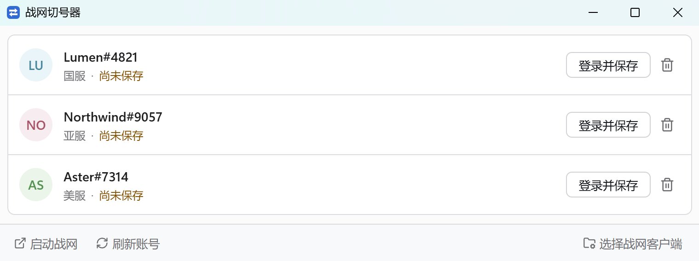

# BnetSwitchLite

在 Windows 和 macOS 上快速切换 Battle.net 账号。

BnetSwitchLite 把你主动保存的本地登录状态整理成账号列表。切换时，程序会自动关闭 Battle.net、恢复目标账号并重新启动客户端；失败时会停止操作并尽量恢复原来的状态。

## 下载

前往 [Releases](https://github.com/kabxx/BnetSwitchLite/releases) 下载对应架构的独立安装包：

| 平台 | 下载选择 |
| --- | --- |
| Windows | x64：`BnetSwitchLite-版本-windows-x64.exe` |
| Windows | ARM64：`BnetSwitchLite-版本-windows-arm64.exe` |
| macOS | Apple Silicon：`BnetSwitchLite-版本-macos-arm64.zip` |
| macOS | Intel：`BnetSwitchLite-版本-macos-x64.zip` |

macOS 请下载与你的 Mac 匹配的架构，解压后打开完整的 `BnetSwitchLite.app`。不要单独复制或运行 `.app` 里面的可执行文件。

## 开始使用

1. 启动 BnetSwitchLite。第一次使用时选择本机的 Battle.net 客户端：Windows 选择 `Battle.net.exe`，macOS 选择 `Battle.net.app`。
2. 点击“刷新账号”，读取 Battle.net 当前已经登录的账号。
3. 对要保存的账号点击“登录并保存”，按 Battle.net 的提示完成登录，回到工具并等待保存完成。
4. 账号显示为已保存后，点击“切换”即可使用。

之后切换账号不需要手动复制文件。请等当前操作完成，再继续操作 Battle.net。

### macOS 首次打开

如果 macOS 阻止打开应用，在 Finder 中右键点击 `BnetSwitchLite.app`，选择“打开”。仍然被阻止时，打开“系统设置 > 隐私与安全性”，在安全提示旁选择“仍要打开”。

### Windows 使用位置

Windows 版无需安装。请把 `.exe` 放在本机可写目录中运行，不要放在网络盘、共享目录或自动同步的云盘中。

## 账号操作

| 操作 | 用途 |
| --- | --- |
| 刷新账号 | 重新读取 Battle.net 当前记录，不修改已保存状态 |
| 登录并保存 | 为账号建立可切换的本地状态 |
| 切换 | 使用已保存的账号状态启动 Battle.net |
| 重新登录 | 登录失效后重新保存该账号状态 |
| 移除账号 | 删除工具保存的该账号状态，不删除 Battle.net 账号 |
| 启动战网 | 在 Battle.net 未运行时启动客户端 |

“登录并保存”和“重新登录”会核对最终登录的账号。登录成其他账号时，工具不会把错误状态保存到当前条目。

## 常见问题

### 列表显示“未发现账号”

先在官方 Battle.net 客户端中完成登录，等待客户端稳定后回到 BnetSwitchLite 点击“刷新账号”。仍没有账号时，重新检查客户端路径：Windows 应选择主程序 `Battle.net.exe`，macOS 应选择完整的 `Battle.net.app`。

### Battle.net 无法关闭或切换等待很久

先停止 Battle.net 正在进行的更新、安装或登录操作，再重试。如果客户端无法确认已经退出，本次切换会停止并尽量保留原账号状态。

### 登录状态失效

点击对应账号的“重新登录”，在 Battle.net 中登录同一个账号并等待完成。仍然失败时，移除该账号后重新保存。

### macOS 显示无法确认 Battle.net 来源

请重新选择完整且未被修改的 `Battle.net.app`，通常位于 `/Applications/Battle.net.app`。不要选择 Battle.net Helper 或应用内部的其他可执行文件。

### Windows 显示“未知发布者”

Windows 首次运行可能显示 SmartScreen 提示。请确认文件来自可信的 Releases 页面，并在运行前核对发布页提供的 SHA-256。

## 本地数据与隐私

工具只在本机保存设置、账号列表和你主动保存的登录状态，不会上传数据，也不会读取 Battle.net 明文密码。保存的本地登录状态可能具有复用登录的能力，请不要公开或上传数据目录。

| 平台 | 数据目录 |
| --- | --- |
| Windows | `.exe` 同级的 `BnetSwitchLiteData` |
| macOS | `~/Library/Application Support/BnetSwitchLite` |

### 删除全部本地记录

退出 BnetSwitchLite 后，删除对应平台的数据目录：

- Windows：删除 `.exe` 同级的 `BnetSwitchLiteData`
- macOS：删除 `~/Library/Application Support/BnetSwitchLite`

这会删除已保存账号、设置和未完成操作记录，不会删除 Battle.net 自己的账号数据或客户端文件。下次启动工具时，数据目录会重新创建。

## 系统要求

- Windows 10/11，x64 或 ARM64，Battle.net 桌面客户端，以及 Microsoft Edge WebView2 Runtime
- macOS，Apple Silicon 或 Intel，Battle.net 桌面客户端

Battle.net 更新后如果某个已保存账号无法使用，请先用“重新登录”更新该账号；仍然失败时再移除并重新保存，不要手动修改 Battle.net 数据文件。

## 开发者

开发环境、构建命令、测试和发布流程见 [开发者文档](docs/DEVELOPMENT.md)。

## 许可证

BnetSwitchLite 使用 [MIT License](LICENSE)。第三方依赖的版权和许可证文本见 [NOTICE](NOTICE)。Battle.net 是其权利人的商标，本项目仅用于说明兼容性。
